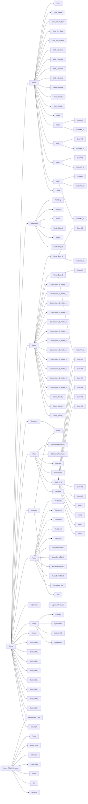

```mermaid

graph LR;

Room --> Door;
Room --> Door_Handle;
Room --> Door_Handle_Base;
Room --> Door_Key_Base;
Room --> Door_Key_Zylinder;
Room --> Wall_4_Outside;
Room --> Wall_3_Outside;
Room --> Wall_2_Outside;
Room --> Wall_1_Outside;
Room --> Ceiling_Outside;
Room --> Floor_Outside;
Room --> Door_Outside;
Room --> Floor;
Wall_3 --> Cube005;
Wall_3 --> Cube005_1;
Wall_2 --> Cube008;
Wall_2 --> Cube008_1;
Wall_4 --> Cube009;
Wall_4 --> Cube009_1;
Wall_1 --> Cube001;
Wall_1 --> Cube001_1;
Wall_1 --> Cube001_2;
Room --> Wall_3;
Room --> Wall_2;
Room --> Wall_4;
Room --> Wall_1;
Room --> Ceiling;
Blackboard --> RightLeg;
Blackboard --> LeftLeg;
Blackboard --> Board1;
Blackboard --> Kreideablage1;
Blackboard --> Board2;
Blackboard --> Kreideablage2;
Closet --> Closet_Door_1;
Closet --> Closet_Door_2;
Closet --> Closet_Board_2_Holder_2;
Closet --> Closet_Board_2_Holder_1;
Closet --> Closet_Board_1_Holder_1;
Closet --> Closet_Board_1_Holder_2;
Closet --> Closet_Board_3_Holder_2;
Closet --> Closet_Board_3_Holder_1;
Closet --> Closet_Board_3_Holder_4;
Closet --> Closet_Board_3_Holder_3;
Closet --> Closet_Board_1_Holder_3;
Closet --> Closet_Board_1_Holder_4;
Closet --> Closet_Board_2_Holder_4;
Closet --> Closet_Board_2_Holder_3;
Closet --> Closet_Board_2;
Closet --> Closet_Board_3;
Closet --> Closet_Board_1;
Closet_Door_2 --> Cube007;
Closet_Door_2 --> Cube007_1;
Closet_Door_1 --> Cube020;
Closet_Door_1 --> Cube020_1;
Sideboard --> Cube;
Chair --> SitzRoehreAbschluss2;
Chair --> SitzRoehreAbschluss1;
Chair --> Roehre1;
Chair --> Roehre1001;
Chair --> Stuhl_01_1;
Stuhl_01_1 --> Cube785;
Stuhl_01_1 --> Cube786;
Stuhl_01_1 --> Cube787;
Stuhl_01_1 --> Cube788;
Stuhl_01_1 --> Cube791;
Stuhl_01_1 --> Cube792;
Stuhl_01_1 --> Cube799;
Stuhl_01_1 --> Cube800;
Stuhl_01_1 --> Niete1;
Stuhl_01_1 --> Niete2;
Stuhl_01_1 --> Niete3;
Stuhl_01_1 --> Niete4;
Chair --> Sitzplatte;
Table --> Tischplatte;
Table --> Tischbein4;
Table --> Tischbein3;
Table --> Tischbein2;
Table --> Tischbein1;
Table --> LangeBeinst端tze2;
Table --> LangeBeinst端tze1;
Table --> KurzeBeinst端tze2;
Table --> KurzeBeinst端tze1;
Table --> Tischplatte_Top;
Keyboard --> Text;
Keyboard --> Cube;
Lightswitch --> LightswitchHousing;
Lamp --> Cylinder;
Lamp --> Cylinder001;
Lamp --> Cylinder002;
Lamp --> Cylinder003;
Scene --> Room;
Scene --> Blackboard;
Scene --> Closet;
Scene --> Sideboard;
Scene --> Chair;
Scene --> Table;
Scene --> Keyboard;
Scene --> Monitor;
Scene --> Lightswitch;
Scene --> Bulb_Light_0;
Scene --> Lamp;
Scene --> Bulb_Light_1;
Scene --> Bulb_Light_2;
Scene --> Bulb_Light_3;
Scene --> Bulb_Light_4;
Scene --> Bulb_Light_5;
Scene --> Bulb_Light_6;
Scene --> Bulb_Light_7;
Scene --> Hemisphere_Light;
Scene --> Day_Light;

Scene_Flight_Simulator --> Torus;
Scene_Flight_Simulator --> Extra_Torus;
Scene_Flight_Simulator --> Obstacle;
Scene_Flight_Simulator --> Point_Light;
Scene_Flight_Simulator --> Hemisphere_Light;
Scene_Flight_Simulator --> Water;
Scene_Flight_Simulator --> Sky;
Scene_Flight_Simulator --> Airplane;

```