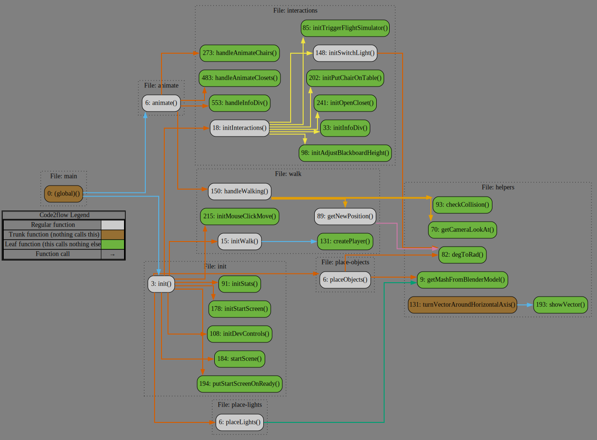
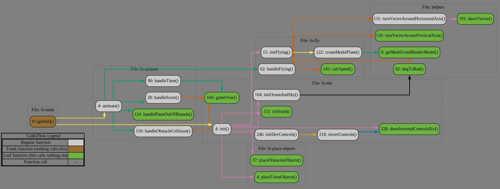

# Flugschule mit Flugsimulator
Computergrafik-Projekt von Henry Schuler, Johannes Brandenburger und Lukas Braun


## Features

- 3D-Modellierung einer Flugschule
- Flugsimulator-Spiel
- Animationen und Interaktionen in der Szene durch die Maus auslösbar
- Realistische Beleuchtung und Schatten
- Laufsteuerung per WASD mit Kollisionsdetektion

...


- Kamerasteuerung mit der Maus
- Steuerung des Flugzeugs mit der Maus
- Tastaturkürzel für schnelle Steuerung von Licht, Schatten und anderen Features
- Informationen über Interaktionen in der Nähe von Objekten


## Interaktionen in der Flugschule

- Klicken auf den Stuhl, um ihn auf den Tisch zu stellen (und zurück)
- Klicken auf den Computer, um den Flugsimulator zu starten
- Klicken auf den Lichtschalter, um das Licht an/aus zu schalten
- Klicken auf den Schrank, um ihn zu öffnen/schließen
- Bewegen der Tafel mit der Maus, um deren Höhe anzupassen


## Tastaturbefehle in der Flugschule

| Taste | Funktion |
| --- | --- |
| WASD | Laufsteuerung |
| L   | Alle Licher an/aus schalten |
| C   | Stuhl-Schatten an/aus schalten (Standardmäßig deaktiviert für mehr Performance) |
| T   | Tisch-Schatten an/aus schalten (Standardmäßig aktiviert) |
| F   | Flugsimulator starten |
| J   | FPS Anzeige ein-/ausblenden |
| H   | Diese Hilfe anzeigen |
| U   | Kollisionsdetektion ein-/ausschalten |


## Tastaturbefehle im Flugsimulator

| Taste | Funktion |
| --- | --- |
| P   | Pause |
| I   | Steuerung umdrehen |
| F   | Flugsimulator beenden und zurück zur Flugschule |
| J   | FPS Anzeige ein-/ausblenden |


## Installation

1. Klonen/Herunterladen des Repositories
2. Wenn node und npm noch nicht installiert sind, installieren Sie sie von [nodejs.org](https://nodejs.org/en/).
3. Führen Sie `npm run start` aus, um alle Abhängigkeiten zu installieren und den Server auf Port 3000 zu starten.
4. Öffnen Sie [localhost:3000](http://localhost:3000) in Ihrem Browser.


## Aufbau der Applikation

```bash
|--- index.html
|--- js/
|--- css/
|--- blender/
|--- ...
|--- flight-simulator/
|   |--- index.html
|   |--- js/
|   |--- css/
|   |--- ...
```






